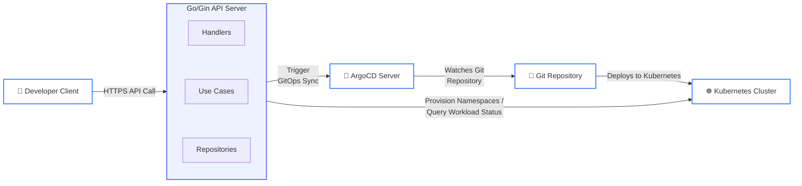
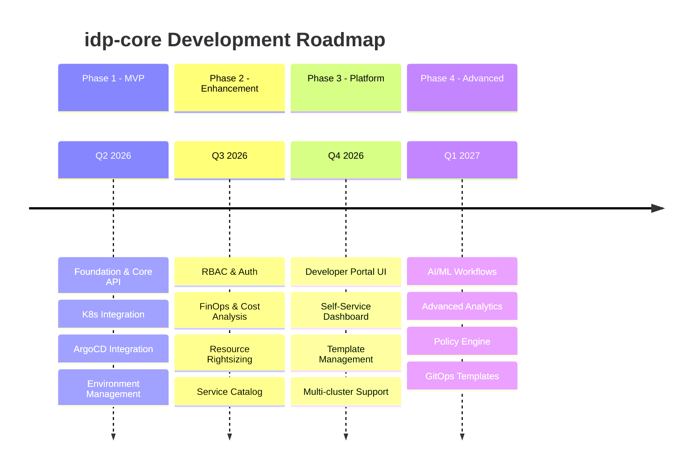

# 📋 idp-core — Product Requirements Document (PRD) Overview

> **Project**: `idp-core`  
> **Owner**: Platform Engineering Team  
> **Last Updated**: April 2026  
> **Status**: In Development

---

## 🎯 Executive Summary

`idp-core` is an Internal Developer Platform (IDP) API that enables engineering teams to self-provision Kubernetes environments on-demand, trigger GitOps deployments via ArgoCD, and monitor live workload status—all through a clean, documented REST interface.

### Project Vision

Reduce environment provisioning time from days to minutes while providing a self-service API that abstracts Kubernetes complexity from developers.

### Architecture Overview

---

## 📅 Phase Roadmap

---

## 🚀 Phase 1: MVP (Current)

**Status**: ✅ Approved for Development  
**Timeline**: May - June 2026  
**Document**: [PRD_PHASE_1.md](./PRD_PHASE_1.md)

### Goals

| Goal | Metric | Target |
|------|--------|--------|
| Reduce environment provisioning time | Time from API call → ready namespace | < 3 minutes |
| Enable self-service without cluster access | % of env requests via API (vs manual) | > 90% |
| Provide real-time workload visibility | Status freshness (last updated) | < 30 seconds |
| Ensure GitOps consistency | % of envs with successful ArgoCD sync | > 95% |
| Maintain API reliability | Uptime (SLA) | 99.9% |

### Key Features

- ✅ Environment Management (Create, Read, Update, Delete)
- ✅ Kubernetes Namespace Provisioning
- ✅ ArgoCD Application Integration
- ✅ GitOps Sync Triggers
- ✅ Workload Status Monitoring
- ✅ Health & Readiness Probes
- ✅ OpenAPI Documentation

### API Endpoints

| Category | Endpoints |
|----------|-----------|
| Environment Management | `POST /environments`, `GET /environments`, `GET /environments/:id`, `DELETE /environments/:id` |
| GitOps Integration | `POST /environments/:id/sync`, `GET /environments/:id/gitops/status` |
| Workload Monitoring | `GET /environments/:id/workloads`, `GET /environments/:id/workloads/:name` |
| System Health | `GET /health`, `GET /ready` |

### Non-Goals (Phase 1)

- ❌ User authentication/authorization (Phase 2: RBAC)
- ❌ Multi-cluster cost analysis (Phase 2: FinOps)
- ❌ Automated resource rightsizing (Phase 2)
- ❌ Developer portal UI (Phase 3)
- ❌ Service catalog discovery (Phase 2)

---

## 🔐 Phase 2: Enhancement (Planned)

**Status**: 📋 Planning  
**Timeline**: Q3 2026  
**Document**: PRD_PHASE_2.md (To be created)

### Goals

| Goal | Metric | Target |
|------|--------|--------|
| Secure multi-tenant access | RBAC implementation | 100% role coverage |
| Cost visibility | Cost per environment tracking | Real-time |
| Resource optimization | Right-sizing recommendations | Auto-generated |

### Key Features

- 🔐 **RBAC & Authentication**
  - OIDC/JWT authentication
  - Role-based access control
  - Team-level permissions
  - Audit logging

- 💰 **FinOps & Cost Analysis**
  - Multi-cluster cost tracking
  - Cost allocation by team/environment
  - Budget alerts
  - Resource utilization reports

- ⚙️ **Resource Rightsizing**
  - CPU/Memory recommendations
  - Automated scaling suggestions
  - Resource quota management
  - Performance metrics integration

- 📚 **Service Catalog**
  - Template discovery
  - Service registration
  - Dependency management
  - Version tracking

### Planned API Endpoints

| Category | Endpoints |
|----------|-----------|
| Authentication | `POST /auth/login`, `POST /auth/refresh`, `GET /users/me` |
| Authorization | `GET /roles`, `GET /permissions`, `POST /roles/:id/permissions` |
| Cost Analysis | `GET /environments/:id/costs`, `GET /teams/:id/costs` |
| Rightsizing | `GET /environments/:id/recommendations`, `POST /environments/:id/rightsize` |
| Service Catalog | `GET /services`, `GET /services/:id`, `POST /services` |

---

## 🖥️ Phase 3: Platform (Planned)

**Status**: 📋 Planning  
**Timeline**: Q4 2026  
**Document**: PRD_PHASE_3.md (To be created)

### Goals

| Goal | Metric | Target |
|------|--------|--------|
| Developer self-service | UI adoption rate | > 80% |
| Template standardization | Template usage | 100% environments |
| Multi-cluster support | Cluster coverage | All production clusters |

### Key Features

- 🖥️ **Developer Portal UI**
  - Web-based dashboard
  - Environment visualization
  - Real-time status updates
  - Self-service workflows

- 📋 **Template Management**
  - Custom template creation
  - Template versioning
  - Template marketplace
  - Parameter validation

- 🌐 **Multi-cluster Support**
  - Cluster registration
  - Cross-cluster deployments
  - Cluster-aware routing
  - Federated monitoring

### Planned UI Features

| Feature | Description |
|---------|-------------|
| Dashboard | Overview of all environments, status, costs |
| Environment Browser | Create, manage, monitor environments |
| Template Editor | Create and edit environment templates |
| Cost Explorer | View and analyze resource costs |
| Workload Viewer | Real-time workload status and logs |
| Settings | User preferences, API keys, notifications |

---

## 🤖 Phase 4: Advanced (Future)

**Status**: 🔮 Roadmap  
**Timeline**: Q1 2027+  
**Document**: PRD_PHASE_4.md (To be created)

### Potential Features

- 🤖 **AI/ML Workflows**
  - Intelligent resource recommendations
  - Anomaly detection
  - Predictive scaling
  - Cost optimization

- 📊 **Advanced Analytics**
  - Usage patterns analysis
  - Performance insights
  - Capacity planning
  - Trend forecasting

- 🛡️ **Policy Engine**
  - OPA/Rego integration
  - Compliance enforcement
  - Security policies
  - Governance rules

- 🔄 **GitOps Templates**
  - Dynamic template generation
  - Parameter injection
  - Environment promotion
  - Rollback automation

---

## 👥 Target Users & Personas

| Persona | Role | Primary Needs |
|---------|------|--------------|
| **Alex (App Developer)** | Backend/Frontend Engineer | "I need a fresh K8s namespace with my app deployed in <5 mins for feature testing" |
| **Sam (SRE/Platform Engineer)** | Platform/Infra Engineer | "I need a reliable, auditable API to automate environment lifecycle without manual kubectl" |
| **Jordan (Tech Lead)** | Engineering Manager | "I need visibility into team environments and deployment status without cluster access" |
| **Taylor (Security Engineer)** | Security/Compliance | "I need audit trails for environment creation and GitOps actions" |

---

## 🛠️ Technology Stack

| Component | Technology | Version |
|-----------|------------|---------|
| Language | Go | 1.25+ |
| Web Framework | Gin | v1.10+ |
| ORM | GORM | v1.25+ |
| Database | PostgreSQL | 15+ |
| Kubernetes Client | client-go | v0.30+ |
| ArgoCD Client | REST API | v2.11+ |
| Configuration | Viper | v1.18+ |
| Logging | Logrus/Zerolog | Latest |
| Metrics | Prometheus | Latest |
| API Documentation | Swagger/OpenAPI | 3.0 |
| Testing | testify, gomock | Latest |
| CI/CD | GitHub Actions | N/A |
| Container Runtime | Docker | Latest |
| Kubernetes | Kind (dev), K8s (prod) | 1.28+ |

---

## 📊 Success Metrics

### Phase 1 KPIs

| KPI | Target | Measurement |
|-----|--------|-------------|
| Environment Provisioning Time | < 3 minutes | API call to ready namespace |
| API Response Time (p95) | < 500ms (read), < 2s (write) | Prometheus metrics |
| API Availability | 99.9% | Uptime monitoring |
| Test Coverage | > 80% | CI/CD pipeline |
| ArgoCD Sync Success Rate | > 95% | Application status |

### Phase 2+ KPIs (Planned)

| KPI | Target | Phase |
|-----|--------|-------|
| Cost Visibility | 100% environments | Phase 2 |
| RBAC Adoption | 100% users | Phase 2 |
| UI Adoption | > 80% developers | Phase 3 |
| Multi-cluster Coverage | All prod clusters | Phase 3 |

---

## 🗓️ Timeline Summary

| Phase | Timeline | Status | Key Deliverables |
|-------|----------|--------|------------------|
| Phase 1 - MVP | May - June 2026 | ✅ In Development | Core API, K8s/ArgoCD integration |
| Phase 2 - Enhancement | Q3 2026 | 📋 Planning | RBAC, FinOps, Rightsizing |
| Phase 3 - Platform | Q4 2026 | 📋 Planning | UI, Templates, Multi-cluster |
| Phase 4 - Advanced | Q1 2027+ | 🔮 Roadmap | AI/ML, Analytics, Policy |

---

## ⚠️ Risks & Mitigations

| Risk | Impact | Mitigation |
|------|--------|------------|
| ArgoCD API changes | High | Abstract client behind interface; pin version; contract tests |
| K8s permission boundaries | Medium | Dedicated service account; minimal RBAC; document permissions |
| Environment name collisions | Medium | Name+team uniqueness at API + DB layer |
| Git webhook reliability | Low | Fallback to polling; idempotent operations |
| API key leakage | High | Never log sensitive headers; structured logging middleware |

---

## 📎 References

- [PRD Phase 1 - MVP](./PRD_PHASE_1.md)
- [Development TODO List](../DEV_TODO_LIST_PHASE_1.md)
- [Development Guidelines](../DEV_GUIDELINE.md)
- [Test Documentation](../TEST.md)
- [ArgoCD REST API Documentation](https://argo-cd.readthedocs.io/en/stable/developer-guide/api-docs/)
- [Kubernetes client-go Documentation](https://pkg.go.dev/k8s.io/client-go)
- [Gin Web Framework](https://gin-gonic.com/docs/)
- [OpenAPI Specification 3.0](https://swagger.io/specification/)

---

## 📝 Document History

| Version | Date | Author | Changes |
|---------|------|--------|---------|
| 0.1.0 | April 2026 | Platform Engineering | Initial PRD overview |
| 1.0.0 | April 2026 | Platform Engineering | Phase 1 approved, roadmap finalized |
