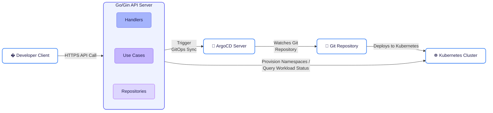
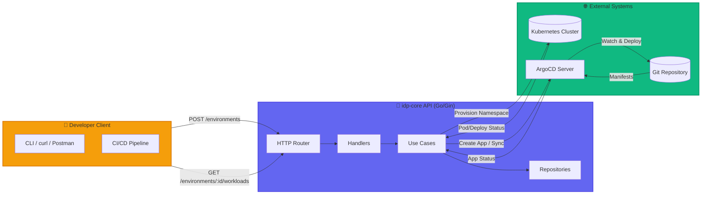
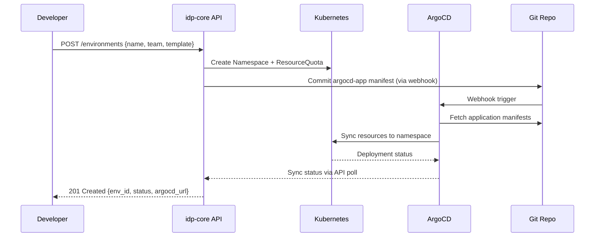
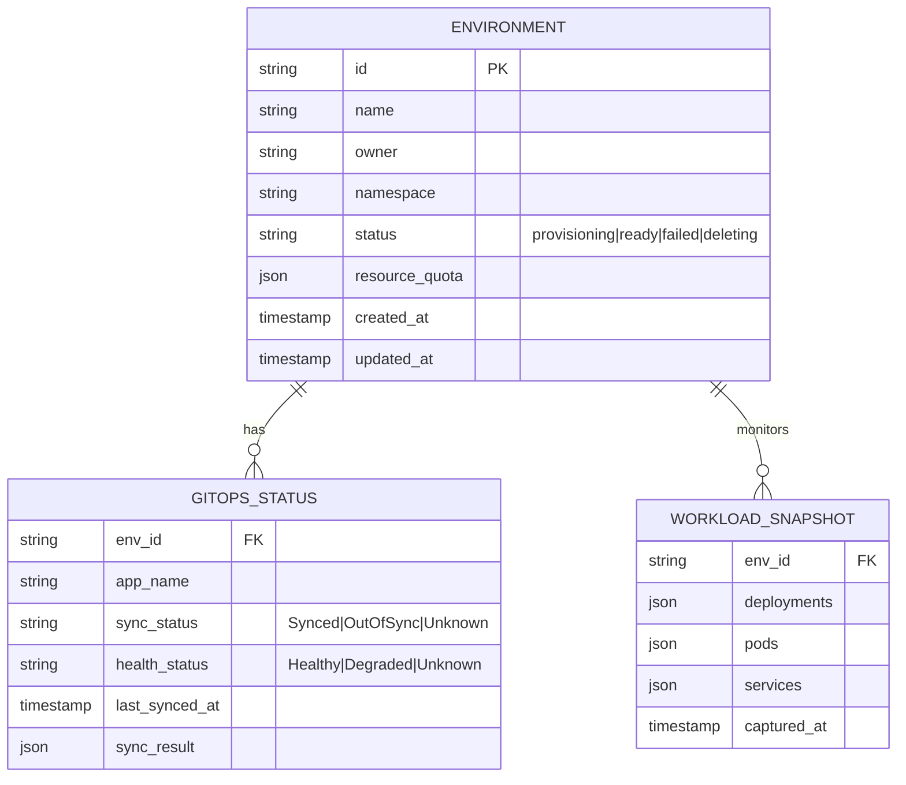

# 📋 idp-core — Phase 1 MVP Product Requirements Document (PRD)

> **Project**: `idp-core`\
> **Phase**: 1 (MVP)\
> **Owner**: Platform Engineering Team\
> **Last Updated**: April 2026\
> **Status**: ✅ Approved for Development

***

## 🎯 1. Executive Summary

`idp-core` is a foundational Internal Developer Platform (IDP) API that enables engineering teams to self-provision Kubernetes environments on-demand, trigger GitOps deployments via ArgoCD, and monitor live workload status—all through a clean, documented REST interface.

**Phase 1 MVP Goal**: Deliver a production-ready, self-service API that reduces environment provisioning time from days to minutes while establishing the architectural foundation for Phase 2+ capabilities (RBAC, FinOps, rightsizing, service catalog).

### Visual Architecture Diagram



***

## 👥 2. Target Users & Personas

| Persona                         | Role                      | Primary Needs                                                                               |
| ------------------------------- | ------------------------- | ------------------------------------------------------------------------------------------- |
| **Alex (App Developer)**        | Backend/Frontend Engineer | "I need a fresh K8s namespace with my app deployed in <5 mins for feature testing"          |
| **Sam (SRE/Platform Engineer)** | Platform/Infra Engineer   | "I need a reliable, auditable API to automate environment lifecycle without manual kubectl" |
| **Jordan (Tech Lead)**          | Engineering Manager       | "I need visibility into team environments and deployment status without cluster access"     |
| **Taylor (Security Engineer)**  | Security/Compliance       | "I need audit trails for environment creation and GitOps actions"                           |

***

## 🎯 3. Goals & Success Metrics

### Primary Goals

| Goal                                       | Metric                                | Target       |
| ------------------------------------------ | ------------------------------------- | ------------ |
| Reduce environment provisioning time       | Time from API call → ready namespace  | < 3 minutes  |
| Enable self-service without cluster access | % of env requests via API (vs manual) | > 90%        |
| Provide real-time workload visibility      | Status freshness (last updated)       | < 30 seconds |
| Ensure GitOps consistency                  | % of envs with successful ArgoCD sync | > 95%        |
| Maintain API reliability                   | Uptime (SLA)                          | 99.9%        |

### Non-Goals (Phase 1)

- ❌ User authentication/authorization (Phase 2: RBAC)
- ❌ Multi-cluster cost analysis (Phase 2: FinOps)
- ❌ Automated resource rightsizing (Phase 2)
- ❌ Developer portal UI (Phase 3)
- ❌ Service catalog discovery (Phase 2)

***

## 🔄 4. System Architecture

### System Architecture Diagram



### Data Flow Sequence (Environment Creation)



***

## 📡 5. API Specification (Phase 1)

### Base URL

```
https://api.idp-core.internal/v1
```

### Authentication

- Phase 1: API Key via header X-API-Key (simple service auth)
- Phase 2: OIDC/JWT + RBAC

### Endpoints

#### 🔹 Environment Management

| Method | Endpoint            | Description                               | Request Body                                           | Response                                           |
| ------ | ------------------- | ----------------------------------------- | ------------------------------------------------------ | -------------------------------------------------- |
| POST   | `/environments`     | Create new K8s environment                | `{name, team, template: "dev\|staging", git_repo_url}` | 201: `{id, namespace, status, created_at}`         |
| GET    | `/environments`     | List environments (filter by team/status) | Query: `?team=platform&status=active`                  | 200: `[{id, name, team, status, created_at}]`      |
| GET    | `/environments/:id` | Get environment details                   | -                                                      | 200: `{id, namespace, config, argocd_app, status}` |
| DELETE | `/environments/:id` | Decommission environment                  | -                                                      | 204: No Content                                    |

#### 🔹 GitOps Integration

| Method | Endpoint                          | Description            | Request Body          | Response                                                 |
| ------ | --------------------------------- | ---------------------- | --------------------- | -------------------------------------------------------- |
| POST   | `/environments/:id/sync`          | Trigger ArgoCD sync    | `{revision?: string}` | 202: `{sync_id, operation_id, status}`                   |
| GET    | `/environments/:id/gitops/status` | Get ArgoCD sync status | -                     | 200: `{sync_status, health_status, last_sync, revision}` |

#### 🔹 Workload Monitoring

| Method | Endpoint                            | Description                   | Request Body                   | Response                                                                  |
| ------ | ----------------------------------- | ----------------------------- | ------------------------------ | ------------------------------------------------------------------------- |
| GET    | `/environments/:id/workloads`       | List live workloads           | Query: `?kind=deployment\|pod` | 200: `[{name, kind, status, replicas, image, created_at}]`                |
| GET    | `/environments/:id/workloads/:name` | Get specific workload details | -                              | 200: `{name, kind, status, pods: [{name, node, phase, ready}], logs_url}` |

#### 🔹 System Health

| Method | Endpoint  | Description                    | Response                                    |
| ------ | --------- | ------------------------------ | ------------------------------------------- |
| GET    | `/health` | Liveness probe                 | 200: `{"status":"ok"}`                      |
| GET    | `/ready`  | Readiness probe (deps healthy) | 200: `{"k8s":"ok","argocd":"ok","db":"ok"}` |

### Example Request/Response

#### Create Environment

```
curl -X POST https://api.idp-core.internal/v1/environments \
  -H "X-API-Key: $API_KEY" \
  -H "Content-Type: application/json" \
  -d '{
    "name": "feature-auth-v2",
    "team": "identity",
    "template": "dev",
    "git_repo_url": "https://github.com/org/auth-service"
  }'
```

#### Response

```
{
  "id": "env_7x9k2m",
  "namespace": "feat-auth-v2-identity",
  "status": "provisioning",
  "argocd_app": "feat-auth-v2-identity",
  "argocd_url": "https://argocd.internal/applications/feat-auth-v2-identity",
  "created_at": "2026-04-30T10:15:00Z"
}
```

#### Get Workload Status

```
curl -X GET https://api.idp-core.internal/v1/environments/env_7x9k2m/workloads \
  -H "X-API-Key: $API_KEY"
```

#### Response

```
{
  "workloads": [
    {
      "name": "auth-service",
      "kind": "Deployment",
      "status": "Running",
      "replicas_desired": 3,
      "replicas_ready": 3,
      "image": "ghcr.io/org/auth-service:feat-auth-v2-abc123",
      "created_at": "2026-04-30T10:17:22Z"
    }
  ]
}
```

***

## 🗃️ 6. Data Models (Phase 1)



### Environment

```
type Environment struct {
    ID          string    `json:"id" gorm:"primaryKey"`
    Name        string    `json:"name" gorm:"uniqueIndex:idx_name_team"`
    Team        string    `json:"team" gorm:"index"`
    Template    string    `json:"template"` // "dev", "staging"
    Namespace   string    `json:"namespace" gorm:"unique"`
    GitRepoURL  string    `json:"git_repo_url"`
    Status      string    `json:"status"` // "provisioning", "active", "degraded", "deleted"
    ArgoCDApp   string    `json:"argocd_app"`
    Config      JSONB     `json:"config,omitempty"` // template overrides
    CreatedAt   time.Time `json:"created_at"`
    UpdatedAt   time.Time `json:"updated_at"`
    DeletedAt   gorm.DeletedAt `json:"-" gorm:"index"`
}
```

### Workload Status (cached view)

```
type WorkloadStatus struct {
    EnvironmentID string    `json:"environment_id" gorm:"index"`
    Name          string    `json:"name"`
    Kind          string    `json:"kind"` // "Deployment", "StatefulSet", "Pod"
    Status        string    `json:"status"` // "Running", "Pending", "Error"
    Replicas      int       `json:"replicas_desired"`
    ReadyReplicas int       `json:"replicas_ready"`
    Image         string    `json:"image"`
    LastChecked   time.Time `json:"last_checked"`
}
```

### API Key (for Phase 1 auth)

```
type APIKey struct {
    ID          string    `json:"id" gorm:"primaryKey"`
    Name        string    `json:"name"` // human-readable label
    KeyHash     string    `json:"-" gorm:"index"` // bcrypt hash of the actual key
    Team        string    `json:"team" gorm:"index"`
    Permissions []string  `json:"permissions" gorm:"type:text[]"` // ["env:create", "env:read", "env:delete"]
    LastUsedAt  time.Time `json:"last_used_at"`
    ExpiresAt   time.Time `json:"expires_at"`
    CreatedAt   time.Time `json:"created_at"`
}
```

***

## ⚙️ 7. Technical Requirements

### Infrastructure Stack

| Component          | Requirement                                                         | Rationale                                                |
| ------------------ | ------------------------------------------------------------------- | -------------------------------------------------------- |
| Runtime            | Go 1.22+, compiled to Linux amd64/arm64                             | Performance, single binary deployment                    |
| Framework          | Gin v1.10+, with middleware for logging/recovery                    | Lightweight, mature, excellent ecosystem                 |
| Database           | PostgreSQL 15+ (GORM ORM)                                           | JSONB support for flexible config, reliable transactions |
| K8s Client         | client-go v0.30+, with dynamic client for CRDs                      | Official client, full API coverage                       |
| ArgoCD Integration | REST API client (v2.11+), fallback to git commit webhook            | Direct control + GitOps best practices                   |
| Observability      | Structured logging (Logrus), Prometheus metrics endpoint `/metrics` | Standard tooling, easy integration with existing infra   |

### Performance & Reliability

- **API response time (p95):** < 500ms for read, < 2s for write (excluding K8s/ArgoCD async ops)
- **Concurrent environment creations:** Support 10+ parallel requests
- **Idempotency:** `POST /environments` with same name+team returns existing env (no duplicate)
- **Retry logic:** Exponential backoff for transient K8s/ArgoCD API failures (max 3 retries)
- **Circuit breaker:** Fail fast if ArgoCD/K8s unreachable > 3 attempts
- **Graceful shutdown:** Drain in-flight requests on SIGTERM (30s timeout)

### Security (Phase 1 Baseline)

- **API Key authentication:** via `X-API-Key` header (stored hashed in DB using bcrypt)
- **TLS termination:** at ingress (API server assumes internal network)
- **Input validation:** All requests validated with `go-playground/validator/v10`
- **Audit logging:** Log all create/delete/sync actions with trace\_id, env\_id, team, user\_agent
- **Secrets management:** Never log or expose K8s tokens/ArgoCD credentials; use Kubernetes Secrets or Vault (Phase 2)
- **Rate limiting:** Per-API-key rate limiting (100 req/min default, configurable)

***

## 🧪 8. Testing Strategy

| Test Type         | Scope                                               | Tools                             | Coverage Target      | Frequency       |
| ----------------- | --------------------------------------------------- | --------------------------------- | -------------------- | --------------- |
| Unit Tests        | Handlers, Use Cases, Utils, Validators              | `testing`, `testify`, `gomock`    | > 80%                | On every commit |
| Integration Tests | K8s client, ArgoCD client, DB repository layer      | `testcontainers-go`, kind cluster | Critical paths       | CI pipeline     |
| E2E Tests         | Full flow: API → K8s → ArgoCD → status              | `ginkgo`, `gomega`, ephemeral env | MVP happy path       | Pre-release     |
| Contract Tests    | OpenAPI spec validation, request/response schema    | `swaggo/swag`, `dredd`            | 100% of endpoints    | CI pipeline     |
| Load Tests        | Concurrent env creation, sustained throughput       | `k6`, `hey`                       | Validate p95 targets | Weekly          |
| Security Tests    | API key validation, input sanitization, auth bypass | `gosec`, manual pen-test          | Critical auth paths  | Pre-release     |

### Test Environment Setup

```
# Local development with kind + mock services
make dev-up          # Start kind cluster + postgres + idp-core + mock-argocd
make dev-logs        # Stream all container logs
make dev-test        # Run unit + integration tests against local env
make dev-e2e         # Run E2E tests against ephemeral environment

# CI/CD pipeline (GitHub Actions)
# See: .github/workflows/test.yml
```

***

## 📦 9. Deployment & Operations

### Development Workflow

```
# Bootstrap local environment
make bootstrap       # Install deps, generate mocks, setup pre-commit hooks

# Run locally with hot-reload
make dev-run         # air + local config

# Run tests
make test            # unit tests
make test-integration # integration tests (requires kind)
make test-e2e        # end-to-end tests

# Build & package
make build           # compile binary
make docker-build    # build Docker image
make docker-push     # push to registry (requires auth)
```

### Production Deployment (Kubernetes)

```
# deployments/kubernetes/deployment.yaml (excerpt)
apiVersion: apps/v1
kind: Deployment
meta
  name: idp-core
  labels:
    app: idp-core
    version: v0.1.0
spec:
  replicas: 3
  strategy:
    type: RollingUpdate
    rollingUpdate:
      maxSurge: 1
      maxUnavailable: 0
  selector:
    matchLabels:
      app: idp-core
  template:
    metadata:
      labels:
        app: idp-core
    spec:
      serviceAccountName: idp-core-sa
      containers:
      - name: api
        image: ghcr.io/yourorg/idp-core:v0.1.0
        imagePullPolicy: IfNotPresent
        ports:
        - containerPort: 8080
          name: http
        env:
        - name: CONFIG_PATH
          value: "/config/config.yaml"
        - name: LOG_LEVEL
          value: "info"
        readinessProbe:
          httpGet:
            path: /ready
            port: 8080
          initialDelaySeconds: 10
          periodSeconds: 10
        livenessProbe:
          httpGet:
            path: /health
            port: 8080
          initialDelaySeconds: 30
          periodSeconds: 30
        resources:
          requests:
            memory: "256Mi"
            cpu: "250m"
          limits:
            memory: "512Mi"
            cpu: "500m"
        volumeMounts:
        - name: config
          mountPath: /config
          readOnly: true
      volumes:
      - name: config
        configMap:
          name: idp-core-config
---
apiVersion: v1
kind: Service
meta
  name: idp-core
spec:
  selector:
    app: idp-core
  ports:
  - port: 80
    targetPort: 8080
    name: http
  type: ClusterIP
```

### Observability & Monitoring

#### Metrics (Prometheus endpoint **/metrics**)

```
# HTTP metrics
http_requests_total{method, endpoint, status}
http_request_duration_seconds{method, endpoint, quantile}

# Business metrics
idp_environments_created_total{team, template}
idp_argocd_sync_duration_seconds{env_id, status}
idp_k8s_api_call_duration_seconds{resource, verb}

# System metrics
go_goroutines, go_memstats_*

```

#### Logging Format (structured JSON)

```
{
  "level": "info",
  "ts": "2026-04-30T10:15:00.123Z",
  "caller": "handler/environment.go:42",
  "msg": "environment created",
  "trace_id": "abc123",
  "env_id": "env_7x9k2m",
  "team": "identity",
  "namespace": "feat-auth-v2-identity",
  "duration_ms": 1842
}
```

#### Alerting Rules (Prometheus Alertmanager)

```
groups:
- name: idp-core-alerts
  rules:
  - alert: IDPCoreHighErrorRate
    expr: sum(rate(http_requests_total{job="idp-core", status=~"5.."}[5m])) / sum(rate(http_requests_total{job="idp-core"}[5m])) > 0.05
    for: 5m
    labels:
      severity: critical
    annotations:
      summary: "idp-core API error rate > 5%"
      
  - alert: IDPCoreArgoCDUnreachable
    expr: idp_argocd_api_call_duration_seconds{status="error"} > 30
    for: 5m
    labels:
      severity: warning
    annotations:
      summary: "ArgoCD integration failing"
```

***

## 🗓️ 10. Phase 1 Timeline & Milestones

### Milestone Deliverables

| Milestone            | Date   | Deliverable                                    | Success Criteria                             |
| -------------------- | ------ | ---------------------------------------------- | -------------------------------------------- |
| M1: Foundation       | May 7  | Repo initialized, CI/CD pipeline, config layer | `make test` passes locally & in CI           |
| M2: Core Integration | May 21 | K8s provisioner + ArgoCD client working        | Can create namespace + ArgoCD app via API    |
| M3: API Complete     | May 29 | All Phase 1 endpoints implemented + documented | OpenAPI spec validates; Swagger UI renders   |
| M4: Validation       | June 4 | Integration + E2E tests passing                | 95%+ test pass rate; p95 latency < targets   |
| M5: MVP Launch       | June 7 | v0.1.0 deployed to staging, ready for pilot    | Zero critical bugs; on-call runbook complete |

***

## ⚠️ 11. Risks & Mitigations

| Risk                                     | Impact | Likelihood | Mitigation                                                                                                             | Owner        |
| ---------------------------------------- | ------ | ---------- | ---------------------------------------------------------------------------------------------------------------------- | ------------ |
| ArgoCD API changes/breaking updates      | High   | Medium     | Abstract client behind GitOpsClient interface; pin ArgoCD version; add contract tests                                  | Platform Eng |
| K8s cluster permission boundaries        | Medium | High       | Use dedicated service account with minimal RBAC; document required permissions upfront; add `make validate-rbac`       | SRE          |
| Environment name collisions              | Medium | Medium     | Enforce name+team uniqueness at API + DB layer; provide suggestion API (`GET /environments/suggest?name=foo`)          | Backend Eng  |
| Git webhook reliability (ArgoCD trigger) | Low    | Medium     | Fallback to polling ArgoCD app status every 10s; idempotent sync operations; log webhook failures                      | Platform Eng |
| Configuration drift (template vs actual) | Medium | Low        | Store template + overrides in DB; add `GET /environments/:id/diff` endpoint (Phase 2); document manual override policy | Platform Eng |
| API key leakage in logs                  | High   | Low        | Never log `X-API-Key` header; use structured logging middleware that redacts sensitive headers; audit log access       | Security Eng |

***

## 📎 12. Appendix

### A. Glossary

| Term        | Definition                                                                                                 |
| ----------- | ---------------------------------------------------------------------------------------------------------- |
| Environment | A namespaced Kubernetes context for a feature/team, including deployed workloads, configured via templates |
| Template    | Predefined K8s manifests + ArgoCD Application spec (variants: dev, staging, prod) stored in a Git repo     |
| GitOps Sync | ArgoCD reconciling desired state (Git repository) with actual state (Kubernetes cluster)                   |
| Workload    | A Kubernetes resource representing a running application component (Deployment, StatefulSet, Pod, etc.)    |
| Provisioner | Internal component responsible for creating K8s resources (Namespace, ResourceQuota, NetworkPolicy, etc.)  |

### B. Open Questions (to resolve before dev start)

- **Async vs Sync API:** Should environment creation be async (202 Accepted + webhook/callback) or sync (201 Created + polling)?
  - **→ Recommendation:** Sync for Phase 1 MVP (simpler DX), with timeout of 120s; add async option in Phase 2.
- **Multi-cluster support:** How to handle multiple Kubernetes clusters in Phase 1?
  - **→ Recommendation:** Single cluster for MVP; abstract Cluster field in Environment model for Phase 2 expansion.
- **Template source of truth:** Where are environment templates defined and versioned?
  - **→ Recommendation:** Git repository with `/templates/{dev,staging,prod}` directories; `git_repo_url` in request points to app repo, templates live in platform repo.
- **API versioning strategy:** How to handle breaking changes post-MVP?
  - **→ Recommendation:** URL path versioning (`/v1/`, `/v2/`); deprecate with 3-month notice; document in OpenAPI spec.

### C. References

- ArgoCD REST API Documentation
- Kubernetes client-go Examples
- Gin Web Framework Best Practices
- Go Project Layout (Standard)
- OpenAPI Specification 3.0

