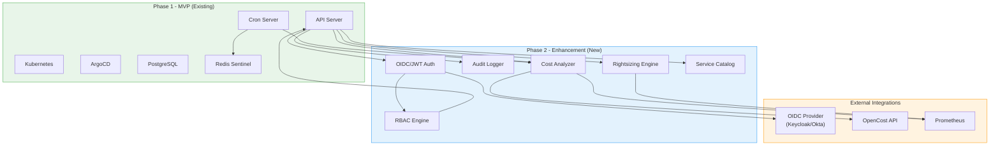

# 📋 idp-core — Product Requirements Document (PRD) Phase 2

> **Project**: `idp-core`
> **Phase**: 2 - Enhancement
> **Owner**: Platform Engineering Team
> **Last Updated**: May 2026
> **Status**: 📋 Planning
> **Timeline**: Q3 2026

---

## 🎯 Executive Summary

Phase 2 enhances the idp-core platform with enterprise-grade security, cost visibility, and resource optimization capabilities. This phase transforms the MVP into a production-ready platform with RBAC, FinOps integration, and service catalog features.

### Phase 2 Goals

| Goal | Metric | Target |
|------|--------|--------|
| Secure multi-tenant access | RBAC implementation | 100% role coverage |
| Cost visibility | Cost per environment tracking | Real-time |
| Resource optimization | Right-sizing recommendations | Auto-generated |
| Service discoverability | Service catalog adoption | > 70% teams |

---

## 🏗️ Architecture Overview



---

## 🔐 Feature 1: RBAC & Authentication

### Overview

Implement enterprise-grade authentication and authorization with OIDC integration, role-based access control, and comprehensive audit logging.

### User Stories

| ID | User Story | Priority |
|----|------------|----------|
| AUTH-001 | As a platform admin, I want to integrate with existing SSO (OIDC) so users can authenticate with corporate credentials | P0 |
| AUTH-002 | As a platform admin, I want to define roles with granular permissions so I can enforce least-privilege access | P0 |
| AUTH-003 | As a team lead, I want to manage team membership so I can control who accesses my team's environments | P0 |
| AUTH-004 | As a security engineer, I want audit logs for all actions so I can track who did what and when | P0 |
| AUTH-005 | As a developer, I want to use API keys for automation so I can integrate CI/CD pipelines | P1 |
| AUTH-006 | As a platform admin, I want to enforce MFA so I can enhance security | P2 |

### Data Model

```go
// User represents an authenticated user
type User struct {
    ID          string    `gorm:"primaryKey"`
    Email       string    `gorm:"uniqueIndex;not null"`
    Name        string    `gorm:"not null"`
    Provider    string    `gorm:"not null"` // oidc, local
    ProviderID  string    `gorm:"index"`
    Status      string    `gorm:"not null"` // active, disabled, pending
    CreatedAt   time.Time
    UpdatedAt   time.Time
    DeletedAt   gorm.DeletedAt `gorm:"index"`
}

// Team represents a group of users
type Team struct {
    ID          string    `gorm:"primaryKey"`
    Name        string    `gorm:"uniqueIndex;not null"`
    Slug        string    `gorm:"uniqueIndex;not null"`
    Description string
    CreatedAt   time.Time
    UpdatedAt   time.Time
    DeletedAt   gorm.DeletedAt `gorm:"index"`
}

// TeamMember represents user-team membership
type TeamMember struct {
    ID        string    `gorm:"primaryKey"`
    TeamID    string    `gorm:"index;not null"`
    UserID    string    `gorm:"index;not null"`
    Role      string    `gorm:"not null"` // owner, admin, member
    CreatedAt time.Time
    UpdatedAt time.Time
}

// Role represents a collection of permissions
type Role struct {
    ID          string    `gorm:"primaryKey"`
    Name        string    `gorm:"uniqueIndex;not null"`
    Description string
    IsSystem    bool      `gorm:"default:false"` // system roles cannot be deleted
    CreatedAt   time.Time
    UpdatedAt   time.Time
    DeletedAt   gorm.DeletedAt `gorm:"index"`
}

// Permission represents a granular access right
type Permission struct {
    ID          string    `gorm:"primaryKey"`
    Name        string    `gorm:"uniqueIndex;not null"`
    Resource    string    `gorm:"not null"` // environment, team, service, etc.
    Action      string    `gorm:"not null"` // create, read, update, delete, sync
    Description string
    CreatedAt   time.Time
}

// RolePermission maps roles to permissions
type RolePermission struct {
    ID           string `gorm:"primaryKey"`
    RoleID       string `gorm:"index;not null"`
    PermissionID string `gorm:"index;not null"`
}

// UserRole represents user-role assignments
type UserRole struct {
    ID        string    `gorm:"primaryKey"`
    UserID    string    `gorm:"index;not null"`
    RoleID    string    `gorm:"index;not null"`
    Scope     string    // team_id for team-scoped roles, empty for global
    CreatedAt time.Time
}

// APIKey represents an API key for automation
type APIKey struct {
    ID          string    `gorm:"primaryKey"`
    UserID      string    `gorm:"index;not null"`
    Name        string    `gorm:"not null"`
    KeyHash     string    `gorm:"not null"`
    Prefix      string    `gorm:"not null"` // first 8 chars for identification
    ExpiresAt   *time.Time
    LastUsedAt  *time.Time
    CreatedAt   time.Time
    DeletedAt   gorm.DeletedAt `gorm:"index"`
}

// AuditLog represents an auditable action
type AuditLog struct {
    ID         string    `gorm:"primaryKey"`
    Timestamp  time.Time `gorm:"index;not null"`
    UserID     string    `gorm:"index;not null"`
    TeamID     string    `gorm:"index"`
    Action     string    `gorm:"not null"`
    Resource   string    `gorm:"not null"`
    ResourceID string    `gorm:"index"`
    Details    string    `gorm:"type:jsonb"`
    IPAddress  string
    UserAgent  string
    Status     string    `gorm:"not null"` // success, failure
    Error      string
}
```

### API Endpoints

| Method | Endpoint | Description | Auth |
|--------|----------|-------------|------|
| POST | `/auth/login` | OIDC login redirect | Public |
| POST | `/auth/callback` | OIDC callback | Public |
| POST | `/auth/refresh` | Refresh access token | User |
| POST | `/auth/logout` | Logout user | User |
| GET | `/auth/me` | Get current user info | User |
| GET | `/users` | List users | Admin |
| GET | `/users/:id` | Get user details | Admin |
| PATCH | `/users/:id` | Update user | Admin |
| DELETE | `/users/:id` | Disable user | Admin |
| GET | `/teams` | List teams | User |
| POST | `/teams` | Create team | Admin |
| GET | `/teams/:id` | Get team details | Team Member |
| PATCH | `/teams/:id` | Update team | Team Admin |
| DELETE | `/teams/:id` | Delete team | Admin |
| POST | `/teams/:id/members` | Add team member | Team Admin |
| DELETE | `/teams/:id/members/:userId` | Remove team member | Team Admin |
| GET | `/roles` | List roles | User |
| POST | `/roles` | Create role | Admin |
| GET | `/roles/:id` | Get role details | User |
| PATCH | `/roles/:id` | Update role | Admin |
| DELETE | `/roles/:id` | Delete role | Admin |
| POST | `/roles/:id/permissions` | Add permission to role | Admin |
| DELETE | `/roles/:id/permissions/:permId` | Remove permission | Admin |
| POST | `/users/:id/roles` | Assign role to user | Admin |
| DELETE | `/users/:id/roles/:roleId` | Remove role from user | Admin |
| GET | `/api-keys` | List user's API keys | User |
| POST | `/api-keys` | Create API key | User |
| DELETE | `/api-keys/:id` | Revoke API key | User |
| GET | `/audit-logs` | List audit logs | Admin |
| GET | `/audit-logs/:id` | Get audit log details | Admin |

### Default Roles

| Role | Description | Permissions |
|------|-------------|-------------|
| `platform_admin` | Full platform access | All permissions |
| `team_admin` | Team administration | team:read, team:update, team-member:*, environment:* |
| `developer` | Standard developer | environment:read, environment:create, environment:update |
| `viewer` | Read-only access | environment:read, team:read |

### OIDC Integration

```yaml
auth:
  oidc:
    enabled: true
    provider: "keycloak" # keycloak, okta, auth0, azure-ad
    issuer_url: "https://auth.example.com/realms/platform"
    client_id: "idp-core"
    client_secret: "${OIDC_CLIENT_SECRET}"
    redirect_url: "https://idp.example.com/auth/callback"
    scopes:
      - openid
      - profile
      - email
      - groups
    groups_claim: "groups"
    admin_group: "platform-admins"
```

---

## 💰 Feature 2: FinOps & Cost Analysis

### Overview

Integrate with OpenCost and Prometheus to provide real-time cost visibility, cost allocation by team/environment, budget alerts, and resource utilization reports.

### User Stories

| ID | User Story | Priority |
|----|------------|----------|
| COST-001 | As a team lead, I want to see my team's environment costs so I can manage budget | P0 |
| COST-002 | As a platform admin, I want to see total platform costs so I can report to leadership | P0 |
| COST-003 | As a team lead, I want to set budget alerts so I know when costs exceed thresholds | P0 |
| COST-004 | As a developer, I want to see cost breakdown by workload so I can optimize | P1 |
| COST-005 | As a platform admin, I want historical cost trends so I can forecast | P1 |
| COST-006 | As a finance team member, I want cost export (CSV) for accounting | P2 |

### Data Model

```go
// CostRecord represents a cost data point
type CostRecord struct {
    ID              string    `gorm:"primaryKey"`
    Timestamp       time.Time `gorm:"index;not null"`
    EnvironmentID   string    `gorm:"index"`
    TeamID          string    `gorm:"index"`
    Namespace       string    `gorm:"index;not null"`
    WorkloadType    string    // pod, deployment, statefulset, daemonset
    WorkloadName    string    `gorm:"index"`
    ResourceType    string    // cpu, memory, storage, network, gpu
    ResourceRequest float64   // requested amount
    ResourceUsage   float64   // actual usage
    CostRequest     float64   // cost based on requests
    CostUsage       float64   // cost based on usage
    Currency        string    `gorm:"default:USD"`
    CreatedAt       time.Time
}

// Budget represents a budget configuration
type Budget struct {
    ID            string     `gorm:"primaryKey"`
    TeamID        string     `gorm:"index;not null"`
    EnvironmentID string     `gorm:"index"` // empty for team-wide budget
    Name          string     `gorm:"not null"`
    Limit         float64    `gorm:"not null"`
    Period        string     `gorm:"not null"` // daily, weekly, monthly
    AlertThresholds []int     `gorm:"type:int[]"` // percentages: [50, 75, 90, 100]
    AlertChannels []string   `gorm:"type:text[]"` // email, slack
    Status        string     `gorm:"not null"` // active, paused
    CreatedAt     time.Time
    UpdatedAt     time.Time
    DeletedAt     gorm.DeletedAt `gorm:"index"`
}

// BudgetAlert represents a budget alert event
type BudgetAlert struct {
    ID          string    `gorm:"primaryKey"`
    BudgetID    string    `gorm:"index;not null"`
    Timestamp   time.Time `gorm:"index;not null"`
    Threshold   int       `gorm:"not null"`
    CurrentSpend float64  `gorm:"not null"`
    Limit       float64   `gorm:"not null"`
    Percentage  float64   `gorm:"not null"`
    SentTo      string    `gorm:"type:text[]"` // recipients
    Status      string    `gorm:"not null"` // sent, failed
    CreatedAt   time.Time
}

// CostReport represents a generated cost report
type CostReport struct {
    ID            string    `gorm:"primaryKey"`
    TeamID        string    `gorm:"index"`
    EnvironmentID string    `gorm:"index"`
    PeriodStart   time.Time `gorm:"not null"`
    PeriodEnd     time.Time `gorm:"not null"`
    TotalCost     float64   `gorm:"not null"`
    Currency      string    `gorm:"default:USD"`
    Breakdown     string    `gorm:"type:jsonb"` // JSON breakdown
    GeneratedAt   time.Time
}
```

### API Endpoints

| Method | Endpoint | Description | Auth |
|--------|----------|-------------|------|
| GET | `/costs/overview` | Platform cost overview | Admin |
| GET | `/costs/teams/:id` | Team cost breakdown | Team Admin |
| GET | `/costs/environments/:id` | Environment cost breakdown | Team Member |
| GET | `/costs/environments/:id/workloads` | Workload cost breakdown | Team Member |
| GET | `/costs/trends` | Historical cost trends | Admin |
| GET | `/budgets` | List budgets | Team Member |
| POST | `/budgets` | Create budget | Team Admin |
| GET | `/budgets/:id` | Get budget details | Team Member |
| PATCH | `/budgets/:id` | Update budget | Team Admin |
| DELETE | `/budgets/:id` | Delete budget | Team Admin |
| GET | `/budgets/:id/alerts` | Get budget alert history | Team Admin |
| POST | `/costs/export` | Export costs (CSV) | Admin |

### OpenCost Integration

Cost data is synchronized by the **idp-core-cron** server on a configurable schedule using Redis distributed locking to ensure exactly-once execution across replicas.

```yaml
finops:
  enabled: true
  opencost:
    base_url: "http://opencost.opencost.svc.cluster.local:9003"
    poll_interval: "1h"
  prometheus:
    url: "http://prometheus-server.monitoring.svc.cluster.local:80"

cron:
  grace_timeout: "900s"
  schedules:
    ping: "*/5 * * * *"
    cost-sync: "0 * * * *"
  port: 8983

redis:
  master_name: "idp-core-redis_sentinel"
  address: "redis-sentinel.idp-core.svc.cluster.local:26379"
  password: "${REDIS_PASSWORD}"
```

---

## ⚙️ Feature 3: Resource Rightsizing

### Overview

Analyze resource usage patterns and provide recommendations for CPU/memory right-sizing to optimize costs and performance.

### User Stories

| ID | User Story | Priority |
|----|------------|----------|
| SIZE-001 | As a developer, I want right-sizing recommendations so I can optimize my workloads | P0 |
| SIZE-002 | As a team lead, I want to see underutilized workloads so I can reduce costs | P0 |
| SIZE-003 | As a developer, I want to apply recommendations automatically so I can save time | P1 |
| SIZE-004 | As a platform admin, I want resource quota management so I can enforce limits | P1 |
| SIZE-005 | As a developer, I want to see usage history so I can make informed decisions | P2 |

### Data Model

```go
// RightsizingRecommendation represents a right-sizing suggestion
type RightsizingRecommendation struct {
    ID              string    `gorm:"primaryKey"`
    EnvironmentID   string    `gorm:"index;not null"`
    Namespace       string    `gorm:"index;not null"`
    WorkloadType    string    `gorm:"not null"`
    WorkloadName    string    `gorm:"not null"`
    ContainerName   string    `gorm:"not null"`
    
    // Current configuration
    CurrentCPURequest    string `gorm:"not null"` // e.g., "500m"
    CurrentCPULimit      string
    CurrentMemoryRequest string `gorm:"not null"` // e.g., "512Mi"
    CurrentMemoryLimit   string
    
    // Recommended configuration
    RecommendedCPURequest    string `gorm:"not null"`
    RecommendedCPULimit      string
    RecommendedMemoryRequest string `gorm:"not null"`
    RecommendedMemoryLimit   string
    
    // Analysis data
    CPUPercentile90    float64 `gorm:"not null"` // 90th percentile usage
    MemoryPercentile90 float64 `gorm:"not null"`
    CPUEfficiency      float64 `gorm:"not null"` // usage/request ratio
    MemoryEfficiency   float64 `gorm:"not not"`
    
    // Savings estimate
    PotentialSavings float64 `gorm:"not null"` // estimated monthly savings
    
    Status           string    `gorm:"not null"` // pending, applied, dismissed
    DismissedReason  string
    DismissedAt      *time.Time
    DismissedBy      string
    AppliedAt        *time.Time
    AppliedBy        string
    
    CreatedAt        time.Time
    UpdatedAt        time.Time
}

// ResourceQuota represents team/environment resource limits
type ResourceQuota struct {
    ID            string    `gorm:"primaryKey"`
    TeamID        string    `gorm:"index;not null"`
    EnvironmentID string    `gorm:"index"` // empty for team-wide quota
    
    // CPU limits
    CPURequestMax string `gorm:"not null"` // e.g., "4"
    CPULimitMax   string `gorm:"not null"`
    
    // Memory limits
    MemoryRequestMax string `gorm:"not null"` // e.g., "8Gi"
    MemoryLimitMax   string `gorm:"not null"`
    
    // Storage limits
    StorageMax string
    
    // Current usage (cached)
    CPURequestUsed    string
    CPULimitUsed      string
    MemoryRequestUsed string
    MemoryLimitUsed   string
    StorageUsed       string
    
    Status        string    `gorm:"not null"` // active, exceeded
    CreatedAt     time.Time
    UpdatedAt     time.Time
}
```

### API Endpoints

| Method | Endpoint | Description | Auth |
|--------|----------|-------------|------|
| GET | `/environments/:id/recommendations` | List rightsizing recommendations | Team Member |
| POST | `/environments/:id/recommendations/:recId/apply` | Apply recommendation | Team Admin |
| POST | `/environments/:id/recommendations/:recId/dismiss` | Dismiss recommendation | Team Admin |
| GET | `/environments/:id/recommendations/:recId/history` | Usage history for workload | Team Member |
| GET | `/quotas` | List resource quotas | Team Member |
| POST | `/quotas` | Create resource quota | Admin |
| GET | `/quotas/:id` | Get quota details | Team Member |
| PATCH | `/quotas/:id` | Update quota | Admin |
| DELETE | `/quotas/:id` | Delete quota | Admin |
| GET | `/quotas/:id/usage` | Get current quota usage | Team Member |

---

## 📚 Feature 4: Service Catalog

### Overview

Provide a service catalog for discovering, registering, and managing services with dependency tracking and version management.

### User Stories

| ID | User Story | Priority |
|----|------------|----------|
| CAT-001 | As a developer, I want to discover available services so I can integrate with them | P0 |
| CAT-002 | As a developer, I want to register my service so others can discover it | P0 |
| CAT-003 | As a team lead, I want to see service dependencies so I can understand impact | P1 |
| CAT-004 | As a developer, I want to see service versions so I can track changes | P1 |
| CAT-005 | As a platform admin, I want to deprecate services so I can manage lifecycle | P2 |

### Data Model

```go
// Service represents a registered service
type Service struct {
    ID              string    `gorm:"primaryKey"`
    TeamID          string    `gorm:"index;not null"`
    Name            string    `gorm:"not null"`
    Slug            string    `gorm:"uniqueIndex;not null"`
    Description     string
    RepositoryURL   string
    DocumentationURL string
    Owner           string    `gorm:"not null"`
    OwnerEmail      string    `gorm:"not null"`
    Status          string    `gorm:"not null"` // active, deprecated, retired
    Visibility      string    `gorm:"not null"` // public, team, private
    Tags            string    `gorm:"type:text[]"` // ["api", "grpc", "internal"]
    CreatedAt       time.Time
    UpdatedAt       time.Time
    DeletedAt       gorm.DeletedAt `gorm:"index"`
}

// ServiceVersion represents a version of a service
type ServiceVersion struct {
    ID              string    `gorm:"primaryKey"`
    ServiceID       string    `gorm:"index;not null"`
    Version         string    `gorm:"not null"` // semver
    Description     string
    Changelog       string
    APIBaseURL      string
    APIDocumentURL  string
    IsLatest        bool      `gorm:"default:false"`
    Status          string    `gorm:"not null"` // stable, beta, deprecated
    ReleasedAt      time.Time
    CreatedAt       time.Time
}

// ServiceEndpoint represents a service API endpoint
type ServiceEndpoint struct {
    ID          string    `gorm:"primaryKey"`
    ServiceID   string    `gorm:"index;not null"`
    VersionID   string    `gorm:"index"`
    Name        string    `gorm:"not null"`
    Method      string    `gorm:"not null"` // GET, POST, PUT, DELETE
    Path        string    `gorm:"not null"`
    Description string
    AuthRequired bool     `gorm:"default:true"`
    RateLimit   string    // e.g., "100/minute"
    CreatedAt   time.Time
}

// ServiceDependency represents a service dependency
type ServiceDependency struct {
    ID              string    `gorm:"primaryKey"`
    ServiceID       string    `gorm:"index;not null"`
    DependsOnID     string    `gorm:"index;not null"`
    DependencyType  string    `gorm:"not null"` // required, optional
    MinVersion      string
    MaxVersion      string
    Description     string
    CreatedAt       time.Time
    UpdatedAt       time.Time
}

// ServiceEnvironment represents a service deployment in an environment
type ServiceEnvironment struct {
    ID            string    `gorm:"primaryKey"`
    ServiceID     string    `gorm:"index;not null"`
    EnvironmentID string    `gorm:"index;not null"`
    VersionID     string    `gorm:"index"`
    EndpointURL   string    `gorm:"not null"`
    Status        string    `gorm:"not null"` // running, stopped, error
    HealthStatus  string    // healthy, unhealthy, unknown
    LastHealthCheck *time.Time
    CreatedAt     time.Time
    UpdatedAt     time.Time
}
```

### API Endpoints

| Method | Endpoint | Description | Auth |
|--------|----------|-------------|------|
| GET | `/services` | List services (discoverable) | User |
| POST | `/services` | Register service | Team Admin |
| GET | `/services/:id` | Get service details | User |
| PATCH | `/services/:id` | Update service | Team Admin |
| DELETE | `/services/:id` | Deprecate service | Admin |
| GET | `/services/:id/versions` | List service versions | User |
| POST | `/services/:id/versions` | Create service version | Team Admin |
| GET | `/services/:id/versions/:versionId` | Get version details | User |
| GET | `/services/:id/endpoints` | List service endpoints | User |
| POST | `/services/:id/endpoints` | Add endpoint | Team Admin |
| GET | `/services/:id/dependencies` | List dependencies | User |
| POST | `/services/:id/dependencies` | Add dependency | Team Admin |
| DELETE | `/services/:id/dependencies/:depId` | Remove dependency | Team Admin |
| GET | `/services/:id/environments` | List service deployments | Team Member |

---

## 🔧 Technical Requirements

### Database Migrations

All new tables require migrations with proper indexing:

```
migrations/
├── 20260501000000_create_users_table.up.sql
├── 20260501000001_create_teams_table.up.sql
├── 20260501000002_create_team_members_table.up.sql
├── 20260501000003_create_roles_table.up.sql
├── 20260501000004_create_permissions_table.up.sql
├── 20260501000005_create_role_permissions_table.up.sql
├── 20260501000006_create_user_roles_table.up.sql
├── 20260501000007_create_api_keys_table.up.sql
├── 20260501000008_create_audit_logs_table.up.sql
├── 20260502000000_create_cost_records_table.up.sql
├── 20260502000001_create_budgets_table.up.sql
├── 20260502000002_create_budget_alerts_table.up.sql
├── 20260503000000_create_rightsizing_recommendations_table.up.sql
├── 20260503000001_create_resource_quotas_table.up.sql
├── 20260504000000_create_services_table.up.sql
├── 20260504000001_create_service_versions_table.up.sql
├── 20260504000002_create_service_endpoints_table.up.sql
├── 20260504000003_create_service_dependencies_table.up.sql
└── 20260504000004_create_service_environments_table.up.sql
```

### Configuration Updates

```yaml
# Phase 2 additions to config.yaml
auth:
  oidc:
    enabled: true
    provider: "keycloak"
    issuer_url: "${OIDC_ISSUER_URL}"
    client_id: "${OIDC_CLIENT_ID}"
    client_secret: "${OIDC_CLIENT_SECRET}"
    redirect_url: "${OIDC_REDIRECT_URL}"
    scopes: ["openid", "profile", "email", "groups"]
    groups_claim: "groups"
    admin_group: "platform-admins"

finops:
  enabled: true
  opencost:
    base_url: "${OPENCOST_URL}"
    api_key: "${OPENCOST_API_KEY}"
  prometheus:
    url: "${PROMETHEUS_URL}"
  sync_interval: "5m"

rightsizing:
  enabled: true
  analysis_interval: "1h"
  lookback_days: 7
  recommendation_ttl: "168h" # 7 days

service_catalog:
  enabled: true
  auto_discovery: false
  default_visibility: "team"
```

### External Dependencies

| Dependency | Purpose | Version |
|------------|---------|---------|
| OpenCost | Cost analysis | 2.0+ |
| Prometheus | Metrics collection | 2.45+ |
| Redis Sentinel | Distributed locking for cron jobs | 6.2+ |
| Keycloak/Okta | OIDC Provider | Latest |

---

## 📊 Success Metrics

| KPI | Target | Measurement |
|-----|--------|-------------|
| RBAC Adoption | 100% users | All users have assigned roles |
| Cost Visibility | 100% environments | All environments have cost tracking |
| Rightsizing Recommendations | > 50% adoption | Recommendations applied vs dismissed |
| Service Catalog Adoption | > 70% teams | Teams with registered services |
| API Response Time (p95) | < 500ms (read), < 2s (write) | Prometheus metrics |
| Audit Log Coverage | 100% actions | All write operations logged |

---

## ⚠️ Risks & Mitigations

| Risk | Impact | Mitigation |
|------|--------|------------|
| OIDC provider downtime | High | Fallback to local auth; cache tokens |
| OpenCost API changes | Medium | Abstract behind interface; contract tests |
| Cost sync latency | Low | Asynchronous processing; stale data warnings |
| Permission explosion | Medium | Predefined roles; limit custom roles |
| Service catalog stale data | Low | Health checks; auto-deprecation |

---

## 🗓️ Timeline

| Milestone | Duration | Deliverables |
|-----------|----------|--------------|
| M1: Auth & RBAC | 3 weeks | OIDC, roles, permissions, audit logs |
| M2: FinOps | 2 weeks | OpenCost integration, budgets, alerts |
| M3: Rightsizing | 2 weeks | Recommendations, quota management |
| M4: Service Catalog | 2 weeks | Service registration, discovery, dependencies |
| M5: Testing & Polish | 1 week | Integration tests, documentation |

**Total Duration**: ~10 weeks

---

## 📎 References

- [PRD Overview](./PRD.md)
- [PRD Phase 1](./PRD_PHASE_1.md)
- [OpenCost API Documentation](https://guide.opencost.com/hc/en-us/articles/4407601907991-API-Reference)
- [OIDC Specification](https://openid.net/connect/)
- [Prometheus Query API](https://prometheus.io/docs/prometheus/latest/querying/api/)

---

## 📝 Document History

| Version | Date | Author | Changes |
|---------|------|--------|---------|
| 0.1.0 | May 2026 | Platform Engineering | Initial Phase 2 PRD |
