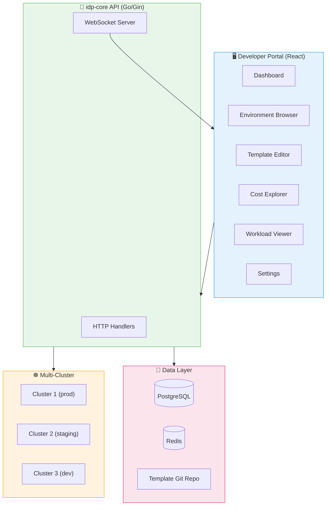

# 📋 idp-core — Product Requirements Document (PRD) Phase 3

> **Project**: `idp-core`
> **Phase**: 3 - Platform
> **Owner**: Platform Engineering Team
> **Last Updated**: May 21, 2026
> **Status**: 📋 Planning
> **Timeline**: Q4 2026

---

## 🎯 Executive Summary

Phase 3 transforms idp-core from a pure API platform into a full Internal Developer Platform (IDP) with a web-based developer portal, template management, and multi-cluster support. This phase focuses on developer experience and self-service capabilities.

### Phase 3 Goals

| Goal | Metric | Target |
|------|--------|--------|
| Developer self-service | UI adoption rate | > 80% |
| Template standardization | Template usage | 100% environments |
| Multi-cluster support | Cluster coverage | All production clusters |
| Developer productivity | Time to production | < 1 hour |

---

## 🏗️ Architecture Overview



---

## 🖥️ Feature 1: Developer Portal UI

### Overview

Build a modern, responsive web application that provides developers with a self-service interface for all platform capabilities. The portal will be built with React and integrate with the idp-core API.

**UI Project**: [`idp-ui`](https://github.com/davidsugianto/idp-ui) (separate repository)

### User Stories

| ID | User Story | Priority |
|----|------------|----------|
| UI-001 | As a developer, I want a dashboard showing my environments so I can quickly access them | P0 |
| UI-002 | As a developer, I want to create environments through a wizard so I don't need to learn the API | P0 |
| UI-003 | As a developer, I want to see real-time workload status so I can monitor my applications | P0 |
| UI-004 | As a team lead, I want to manage team members and permissions through the UI | P1 |
| UI-005 | As a developer, I want to view cost reports in charts so I can understand spending visually | P1 |
| UI-006 | As a platform admin, I want an admin console to manage clusters and templates | P1 |

### UI Components

#### Dashboard

```
┌─────────────────────────────────────────────────────────────┐
│  IDP Platform                                    [User ▼]   │
├─────────────────────────────────────────────────────────────┤
│  ┌──────────┐  ┌──────────┐  ┌──────────┐  ┌──────────┐     │
│  │ Envs: 12 │  │ Active: 8│  │ Cost:$2.4k│  │ Alerts: 2│     │
│  └──────────┘  └──────────┘  └──────────┘  └──────────┘     │
│                                                             │
│  Recent Environments                    [+ New Environment] │
│  ┌─────────────────────────────────────────────────────┐   │
│  │ Name          Team     Status    Cost    Updated    │   │
│  │ feature-auth  backend  ✅ Ready  $120    2h ago     │   │
│  │ staging-api   backend  ⚠ Syncing $340    5m ago     │   │
│  │ dev-frontend  frontend ✅ Ready  $89     1d ago     │   │
│  └─────────────────────────────────────────────────────┘   │
│                                                             │
│  Recommendations                        [View All →]        │
│  ┌─────────────────────────────────────────────────────┐   │
│  │ 💡 Scale down api-deployment (save ~$45/mo)          │   │
│  │ 💡 Increase memory for worker-pod (OOM risk)         │   │
│  └─────────────────────────────────────────────────────┘   │
└─────────────────────────────────────────────────────────────┘
```

#### Environment Browser

```
┌─────────────────────────────────────────────────────────────┐
│  Environments                                    [+ Create]  │
├─────────────────────────────────────────────────────────────┤
│  Filter: [All Teams ▼] [All Clusters ▼] [Status ▼]  [Search]│
│                                                             │
│  ┌─────────────────────────────────────────────────────────┐
│  │ 📦 feature-auth                                        │
│  │ Team: backend  |  Cluster: prod-us-east  |  ✅ Ready   │
│  │ ─────────────────────────────────────────────────────── │
│  │ Workloads: 4  |  Cost: $120/mo  |  Last sync: 2h ago   │
│  │                                                         │
│  │ [View Details] [Sync Now] [View Logs] [Delete]         │
│  └─────────────────────────────────────────────────────────┘
│                                                             │
│  ┌─────────────────────────────────────────────────────────┐
│  │ 📦 staging-api                                         │
│  │ Team: backend  |  Cluster: staging  |  ⚠ Syncing       │
│  │ ─────────────────────────────────────────────────────── │
│  │ Workloads: 6  |  Cost: $340/mo  |  Last sync: 5m ago   │
│  │                                                         │
│  │ [View Details] [Cancel Sync] [View Logs] [Delete]      │
│  └─────────────────────────────────────────────────────────┘
└─────────────────────────────────────────────────────────────┘
```

#### Template Editor

```
┌─────────────────────────────────────────────────────────────┐
│  Template: microservice-base                     [Save] [Preview]
├─────────────────────────────────────────────────────────────┤
│  Name: [microservice-base        ]  Version: [1.2.0 ▼]       │
│  Description: [Standard microservice template              ]│
│                                                             │
│  Parameters                                                 │
│  ┌─────────────────────────────────────────────────────┐   │
│  │ Name        Type      Default    Required    Actions │   │
│  │ app_name    string    -          ✓           [Edit]  │   │
│  │ cpu_limit   string    500m       ✗           [Edit]  │   │
│  │ mem_limit   string    512Mi      ✗           [Edit]  │   │
│  │ replicas    number    2          ✗           [Edit]  │   │
│  │ [+ Add Parameter]                                    │   │
│  └─────────────────────────────────────────────────────┘   │
│                                                             │
│  Resources                                                  │
│  ┌─────────────────────────────────────────────────────┐   │
│  │ 📄 deployment.yaml     [Edit] [Preview]              │   │
│  │ 📄 service.yaml        [Edit] [Preview]              │   │
│  │ 📄 configmap.yaml      [Edit] [Preview]              │   │
│  │ [+ Add Resource]                                     │   │
│  └─────────────────────────────────────────────────────┘   │
└─────────────────────────────────────────────────────────────┘
```

### Technical Stack

| Component | Technology | Version |
|-----------|------------|---------|
| Framework | React | 18+ |
| Build Tool | Vite | 5+ |
| UI Library | Ant Design | 5+ |
| State Management | Zustand / React Query | Latest |
| API Client | Axios / React Query | Latest |
| Real-time | WebSocket / SSE | - |
| Charts | Recharts / ECharts | Latest |
| Forms | React Hook Form + Zod | Latest |
| Router | React Router | 6+ |

### Pages & Routes

| Route | Page | Description |
|-------|------|-------------|
| `/` | Dashboard | Overview with metrics and quick actions |
| `/environments` | EnvironmentList | Browse and filter environments |
| `/environments/:id` | EnvironmentDetail | Environment details and actions |
| `/environments/new` | EnvironmentCreate | Create environment wizard |
| `/templates` | TemplateList | Browse available templates |
| `/templates/:id` | TemplateDetail | Template details and versions |
| `/templates/:id/edit` | TemplateEditor | Edit template |
| `/costs` | CostExplorer | Cost analysis and reports |
| `/costs/team/:id` | TeamCosts | Team-specific cost view |
| `/workloads` | WorkloadList | All workloads across environments |
| `/workloads/:id` | WorkloadDetail | Workload details and logs |
| `/settings` | Settings | User preferences |
| `/settings/api-keys` | APIKeys | Manage API keys |
| `/admin` | AdminConsole | Admin dashboard |
| `/admin/users` | UserManagement | Manage users |
| `/admin/teams` | TeamManagement | Manage teams |
| `/admin/roles` | RoleManagement | Manage roles |
| `/admin/clusters` | ClusterManagement | Manage clusters |

---

## 📋 Feature 2: Template Management

### Overview

Implement a template management system that allows platform teams to define reusable environment templates with parameters, versions, and validation.

### User Stories

| ID | User Story | Priority |
|----|------------|----------|
| TM-001 | As a platform admin, I want to create templates so teams can standardize environments | P0 |
| TM-002 | As a developer, I want to browse templates so I can choose the right starting point | P0 |
| TM-003 | As a platform admin, I want to version templates so I can manage updates safely | P1 |
| TM-004 | As a developer, I want template validation so I know my parameters are correct | P1 |
| TM-005 | As a platform admin, I want a template marketplace so teams can share templates | P2 |

### Data Model

```go
// Template represents an environment template
type Template struct {
    ID          string    `gorm:"primaryKey"`
    Name        string    `gorm:"uniqueIndex;not null"`
    Slug        string    `gorm:"uniqueIndex;not null"`
    Description string    `gorm:"not null"`
    Category    string    `gorm:"index"` // microservice, job, batch, etc.
    Author      string    `gorm:"not null"`
    AuthorEmail string
    Visibility  string    `gorm:"not null"` // public, team, private
    TeamID      string    `gorm:"index"`    // for team templates
    Tags        string    `gorm:"type:text[]"`
    Status      string    `gorm:"not null"` // active, deprecated, archived
    CreatedAt   time.Time
    UpdatedAt   time.Time
    DeletedAt   gorm.DeletedAt `gorm:"index"`
}

// TemplateVersion represents a version of a template
type TemplateVersion struct {
    ID          string    `gorm:"primaryKey"`
    TemplateID  string    `gorm:"index;not null"`
    Version     string    `gorm:"not null"` // semver
    Description string
    Changelog   string
    IsLatest    bool      `gorm:"default:false"`
    IsStable    bool      `gorm:"default:false"`
    Status      string    `gorm:"not null"` // stable, beta, deprecated
    CreatedAt   time.Time
}

// TemplateParameter represents a template parameter
type TemplateParameter struct {
    ID            string    `gorm:"primaryKey"`
    TemplateID    string    `gorm:"index;not null"`
    VersionID     string    `gorm:"index;not null"`
    Name          string    `gorm:"not null"`
    DisplayName   string    `gorm:"not null"`
    Description   string
    Type          string    `gorm:"not null"` // string, number, boolean, enum, array
    Default       string
    Required      bool      `gorm:"default:false"`
    Validation    string    `gorm:"type:jsonb"` // regex, min, max, options, etc.
    Order         int       // display order
    CreatedAt     time.Time
}

// TemplateResource represents a Kubernetes resource in a template
type TemplateResource struct {
    ID          string    `gorm:"primaryKey"`
    TemplateID  string    `gorm:"index;not null"`
    VersionID   string    `gorm:"index;not null"`
    Name        string    `gorm:"not null"`
    Type        string    `gorm:"not null"` // deployment, service, configmap, etc.
    Content     string    `gorm:"type:text;not null"` // YAML/JSON template
    Order       int       // application order
    CreatedAt   time.Time
    UpdatedAt   time.Time
}

// TemplateInstance represents a template used to create an environment
type TemplateInstance struct {
    ID            string    `gorm:"primaryKey"`
    TemplateID    string    `gorm:"index;not null"`
    VersionID     string    `gorm:"index;not null"`
    EnvironmentID string    `gorm:"index;not null"`
    Parameters    string    `gorm:"type:jsonb"` // parameter values used
    CreatedAt     time.Time
}
```

### API Endpoints

| Method | Endpoint | Description |
|--------|----------|-------------|
| GET | `/templates` | List templates (filterable) |
| POST | `/templates` | Create template |
| GET | `/templates/:id` | Get template details |
| PATCH | `/templates/:id` | Update template |
| DELETE | `/templates/:id` | Archive template |
| GET | `/templates/:id/versions` | List template versions |
| POST | `/templates/:id/versions` | Create new version |
| GET | `/templates/:id/versions/:version` | Get specific version |
| PATCH | `/templates/:id/versions/:version` | Update version |
| GET | `/templates/:id/parameters` | List template parameters |
| POST | `/templates/:id/parameters` | Add parameter |
| PATCH | `/templates/:id/parameters/:paramId` | Update parameter |
| DELETE | `/templates/:id/parameters/:paramId` | Remove parameter |
| GET | `/templates/:id/resources` | List template resources |
| POST | `/templates/:id/resources` | Add resource |
| PATCH | `/templates/:id/resources/:resourceId` | Update resource |
| DELETE | `/templates/:id/resources/:resourceId` | Remove resource |
| POST | `/templates/:id/validate` | Validate template parameters |
| POST | `/templates/:id/instantiate` | Create environment from template |

### Built-in Templates

| Template | Description | Use Case |
|----------|-------------|----------|
| `microservice-base` | Standard microservice with Deployment, Service, ConfigMap | Backend services |
| `frontend-app` | Frontend application with CDN, Ingress | Web applications |
| `cron-job` | Scheduled job with CronJob resource | Batch processing |
| `worker-queue` | Worker with HPA and queue consumer | Async processing |
| `database-statefulset` | StatefulSet with PVC and backups | Databases |
| `ml-training-job` | ML training job with GPU support | ML workloads |

---

## 🌐 Feature 3: Multi-Cluster Support

### Overview

Enable idp-core to manage environments across multiple Kubernetes clusters, providing cluster registration, cross-cluster deployments, and federated monitoring.

### User Stories

| ID | User Story | Priority |
|----|------------|----------|
| MC-001 | As a platform admin, I want to register clusters so I can manage multiple environments | P0 |
| MC-002 | As a developer, I want to deploy to specific clusters so I can use the right infrastructure | P0 |
| MC-003 | As a platform admin, I want cluster health monitoring so I can detect issues | P1 |
| MC-004 | As a developer, I want to migrate environments between clusters so I can promote through stages | P1 |
| MC-005 | As a platform admin, I want federated policies so I can enforce standards across clusters | P2 |

### Data Model

```go
// Cluster represents a registered Kubernetes cluster
type Cluster struct {
    ID              string    `gorm:"primaryKey"`
    Name            string    `gorm:"uniqueIndex;not null"`
    DisplayName     string    `gorm:"not null"`
    Description     string
    Endpoint        string    `gorm:"not null"` // API server endpoint
    Region          string    `gorm:"index"`    // us-east-1, eu-west-1, etc.
    Environment     string    `gorm:"index"`    // production, staging, development
    Provider        string    `gorm:"not null"` // aws, gcp, azure, on-prem
    Status          string    `gorm:"not null"` // active, unhealthy, maintenance
    HealthStatus    string    // healthy, degraded, unknown
    LastHealthCheck *time.Time
    Version         string    // K8s version
    NodeCount       int
    CapacityCPU     string
    CapacityMemory  string
    Config          string    `gorm:"type:jsonb"` // cluster-specific config
    CreatedAt       time.Time
    UpdatedAt       time.Time
    DeletedAt       gorm.DeletedAt `gorm:"index"`
}

// ClusterNamespace represents a namespace tracked in a cluster
type ClusterNamespace struct {
    ID          string    `gorm:"primaryKey"`
    ClusterID   string    `gorm:"index;not null"`
    Namespace   string    `gorm:"not null"`
    EnvironmentID string  `gorm:"index"` // linked environment
    Status      string    `gorm:"not null"`
    CreatedAt   time.Time
    UpdatedAt   time.Time
}

// ClusterHealth represents cluster health metrics
type ClusterHealth struct {
    ID                string    `gorm:"primaryKey"`
    ClusterID         string    `gorm:"index;not null"`
    Timestamp         time.Time `gorm:"index;not null"`
    NodeHealth        string    `gorm:"type:jsonb"` // node status map
    PodHealth         string    `gorm:"type:jsonb"` // pod counts by status
    ResourceUsage     string    `gorm:"type:jsonb"` // CPU, memory, storage usage
    ControlPlaneHealth string  // healthy, degraded, unknown
    CreatedAt         time.Time
}
```

### API Endpoints

| Method | Endpoint | Description |
|--------|----------|-------------|
| GET | `/clusters` | List registered clusters |
| POST | `/clusters` | Register new cluster |
| GET | `/clusters/:id` | Get cluster details |
| PATCH | `/clusters/:id` | Update cluster config |
| DELETE | `/clusters/:id` | Deregister cluster |
| GET | `/clusters/:id/health` | Get cluster health |
| GET | `/clusters/:id/namespaces` | List cluster namespaces |
| GET | `/clusters/:id/metrics` | Get cluster metrics |
| POST | `/clusters/:id/test` | Test cluster connectivity |
| POST | `/environments/:id/migrate` | Migrate environment to another cluster |

---

## 🔌 Feature 4: Real-time Updates

### Overview

Implement WebSocket support for real-time updates to the UI, including environment status changes, deployment progress, and log streaming.

### User Stories

| ID | User Story | Priority |
|----|------------|----------|
| RT-001 | As a developer, I want real-time environment status so I don't need to refresh | P0 |
| RT-002 | As a developer, I want to stream logs in the UI so I can debug issues | P0 |
| RT-003 | As a developer, I want deployment progress updates so I know when it's done | P1 |
| RT-004 | As a developer, I want notifications for important events so I stay informed | P1 |

### WebSocket Events

| Event | Direction | Description |
|-------|-----------|-------------|
| `environment:status` | Server → Client | Environment status change |
| `environment:sync` | Server → Client | GitOps sync progress |
| `workload:status` | Server → Client | Workload status change |
| `workload:logs` | Server → Client | Log stream chunk |
| `cluster:health` | Server → Client | Cluster health update |
| `notification:new` | Server → Client | New notification |
| `logs:subscribe` | Client → Server | Subscribe to log stream |
| `logs:unsubscribe` | Client → Server | Unsubscribe from logs |

### Data Model

```go
// Notification represents a user notification
type Notification struct {
    ID          string    `gorm:"primaryKey"`
    UserID      string    `gorm:"index;not null"`
    Type        string    `gorm:"not null"` // info, warning, error, success
    Title       string    `gorm:"not null"`
    Message     string    `gorm:"not null"`
    Resource    string    // environment, workload, cluster
    ResourceID  string
    ActionURL   string    // link to relevant page
    Read        bool      `gorm:"default:false"`
    CreatedAt   time.Time
}

// UserSession represents an active user session
type UserSession struct {
    ID          string    `gorm:"primaryKey"`
    UserID      string    `gorm:"index;not null"`
    Token       string    `gorm:"index;not null"`
    IPAddress   string
    UserAgent   string
    LastActive  time.Time
    ExpiresAt   time.Time
    CreatedAt   time.Time
}
```

---

## 🔧 Technical Requirements

### Database Migrations

```
migrations/
├── 20260601000000_create_templates_table.up.sql
├── 20260601000001_create_template_versions_table.up.sql
├── 20260601000002_create_template_parameters_table.up.sql
├── 20260601000003_create_template_resources_table.up.sql
├── 20260601000004_create_template_instances_table.up.sql
├── 20260601000005_create_clusters_table.up.sql
├── 20260601000006_create_cluster_namespaces_table.up.sql
├── 20260601000007_create_cluster_health_table.up.sql
├── 20260601000008_create_notifications_table.up.sql
├── 20260601000009_create_user_sessions_table.up.sql
```

### Configuration Updates

```yaml
# Phase 3 additions to config.yaml
frontend:
  enabled: true
  base_url: "https://idp.example.com"
  api_base_url: "https://api.idp.example.com"

websocket:
  enabled: true
  path: "/ws"
  heartbeat_interval: "30s"
  write_timeout: "10s"

templates:
  enabled: true
  git_repo_url: "${TEMPLATE_GIT_REPO}"
  git_branch: "main"
  sync_interval: "5m"

multi_cluster:
  enabled: true
  health_check_interval: "1m"
  default_cluster: "prod-us-east"
```

### External Dependencies

| Dependency | Purpose | Version |
|------------|---------|---------|
| React | Frontend framework | 18+ |
| Material UI | Component library | 5+ |
| WebSocket | Real-time updates | - |
| ArgoCD | GitOps (existing) | 2.11+ |
| Prometheus | Metrics (existing) | 2.45+ |

---

## 📊 Success Metrics

| KPI | Target | Measurement |
|-----|--------|-------------|
| UI Adoption | > 80% developers | Unique users vs API-only users |
| Template Usage | 100% environments | Environments from templates |
| Multi-cluster Coverage | All prod clusters | Registered clusters vs total |
| Real-time Latency | < 1s | WebSocket event delivery time |
| Page Load Time | < 2s | Lighthouse performance score |
| Developer Satisfaction | > 4.5/5 | User surveys |

---

## ⚠️ Risks & Mitigations

| Risk | Impact | Mitigation |
|------|--------|------------|
| Frontend complexity | Medium | Use established UI library; component-based architecture |
| WebSocket scalability | Medium | Redis pub/sub for horizontal scaling |
| Multi-cluster auth | High | Use service accounts per cluster; rotate credentials |
| Template security | High | Validate templates; sandbox rendering; review process |
| UI performance | Medium | Code splitting; lazy loading; caching |

---

## 🗓️ Timeline

| Milestone | Duration | Deliverables |
|-----------|----------|--------------|
| M1: Frontend Foundation | 3 weeks | React app, dashboard, auth integration |
| M2: Environment UI | 2 weeks | Environment browser, create wizard, details |
| M3: Template System | 2 weeks | Template CRUD, versioning, instantiation |
| M4: Multi-Cluster | 2 weeks | Cluster registration, cross-cluster deploy |
| M5: Real-time & Polish | 1 week | WebSocket, notifications, testing |

**Total Duration**: ~10 weeks

---

## 📎 References

- [PRD Overview](./PRD.md)
- [PRD Phase 1](./PRD_PHASE_1.md)
- [PRD Phase 2](./PRD_PHASE_2.md)
- [IDP UI Project](https://github.com/davidsugianto/idp-ui) - Developer Portal frontend
- [React Documentation](https://react.dev/)
- [Ant Design](https://ant.design/)
- [WebSocket API](https://developer.mozilla.org/en-US/docs/Web/API/WebSocket)

---

## 📝 Document History

| Version | Date | Author | Changes |
|---------|------|--------|---------|
| 0.1.0 | May 21, 2026 | Platform Engineering | Initial Phase 3 PRD |
